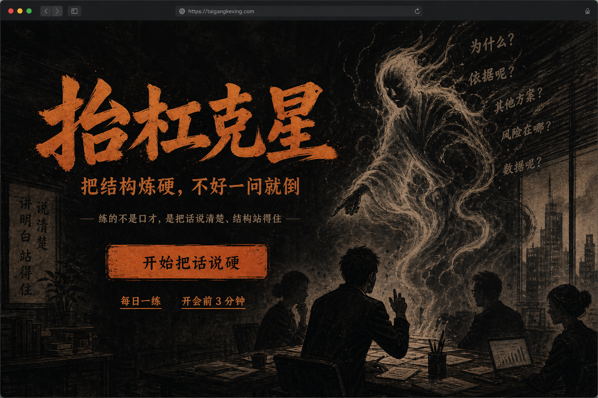
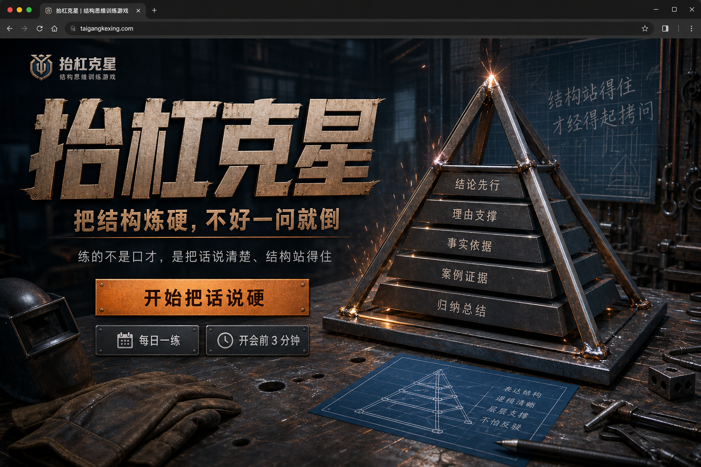
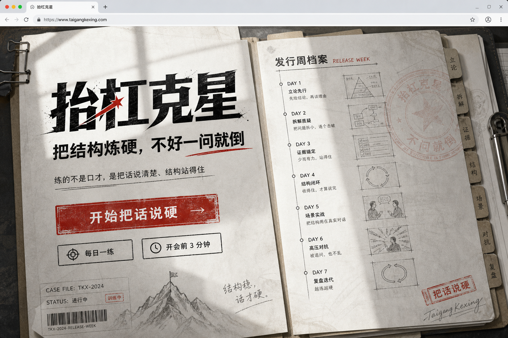

# 抬杠克星 · 页面风格方案（首页首屏）

> 依据产品方案：工具内核 + 游戏外壳；首屏必须同时露出主名 / 副标题 / 一句话；CTA「开始把话说硬」。  
> 每套方案附 **1 张首页可视化**；选定一套后再延展地图 / 关卡 / 结算。

---

## 方案 A · 墨线工坊（与现行产品方案最贴）

**关键词**：职场寓言 · 墨线 · 深底琥珀 · 追问幽灵  

| 项 | 设定 |
|----|------|
| 气质 | 毒舌好玩但不油；像墨线木刻里的职场寓言 |
| 底色 | 炭黑 / 深墨 `#0E0C0A`–`#1A1612` |
| 强调 | 琥珀 / 锈橙 `#D97706`–`#C2410C` |
| 字体 | 显示用有刀味的标题体；正文用清晰无衬线 |
| 氛围图 | 全出血墨线会议室 + 半透明追问幽灵剪影 |
| 适合 | 强化「游戏感 + 幽灵审讯」；与方案 §7「墨线工坊」一致 |

**风险**：深色易被当成又一个暗黑游戏；靠首屏文案与暖琥珀拉回「练结构」。

---

## 方案 B · 焊结构工场

**关键词**：焊死结论 · 金属层板 · 铜橙火花 · 工场隐喻  

| 项 | 设定 |
|----|------|
| 气质 | 工具感更硬：把话「焊」住，不是上课 |
| 底色 | 石板蓝灰 / 枪金属 `#1C2430`–`#2A3441` |
| 强调 | 铜橙 `#E07A3D` + 冷灰高光 |
| 字体 | 偏工业紧缩的中文显示字 |
| 氛围图 | 全出血工台：金属金字塔层板被焊在一起（结构隐喻） |
| 适合 | 强调「焊死 / 堵缝」话术；差异化强于常规口才 App |

**风险**：略偏硬核，生活关温情要靠插图与文案补；避免做成科幻 HUD。

---

## 方案 C · 白班卷宗

**关键词**：通勤工具 · 卷宗时间线 · 朱红戳记 · 日光纸感  

| 项 | 设定 |
|----|------|
| 气质 | 白天也能打开的工具游戏；发布周像一摞卷宗 |
| 底色 | 暖灰白 / 纸纤维 `#F3F1ED`–`#E8E4DC`（避开奶油衬线 Terracotta 套餐：不用大衬线标题，强调用朱红戳而非陶土棕） |
| 强调 | 石墨黑 + 信号朱红 `#C23A2B` |
| 字体 | 当代无衬线显示字，标题仍要有品牌分量 |
| 氛围图 | 全出血打开的卷宗 / 发布周时间线，幽灵以水印戳形式出现 |
| 适合 | 「开会前 3 分钟」场景；走廊测试里更不易被读成斗嘴游戏 |

**风险**：游戏沉浸感弱于 A/B；结算毒舌语气要靠文案补，别做成企业 SaaS。

---

## 三套对比与推荐

| | A 墨线工坊 | B 焊结构工场 | C 白班卷宗 |
|--|------------|--------------|------------|
| 与方案原文 | 最贴 | 延展「焊死」隐喻 | 延展「工具优先」 |
| 游戏感 | 高 | 高 | 中 |
| 工具感 / 反误读 | 中 | 中高 | 高 |
| 实现难度（纯 CSS） | 中（纹理+暗色） | 中高（材质感） | 低–中 |
| 生活关适配 | 靠墨线插图 | 需柔化 | 自然 |

**设计侧推荐**：

1. **默认推 A**（与产品方案「墨线工坊 · 深底琥珀」一致），首屏文案严格按 §1.1。  
2. 若更担心「抬杠=斗嘴」误读、或偏通勤工具 → **选 C**。  
3. 若想品牌更独特、强化「焊结构」记忆点 → **选 B**。

**选定后统一规则（三套通用）**

- 首屏一构图：品牌 > 一句副标题 > 一句说明 > CTA 组 > 一张主氛围图  
- 不用卡片堆英雄区；不用紫渐变 / 霓虹光晕 / 圆角胶囊簇  
- 结算可毒舌；首页必须一眼读成「练结构」  

请选定 A / B / C（或「A 底 + C 的日间模式」），再出地图页与关卡表达架延展稿。
