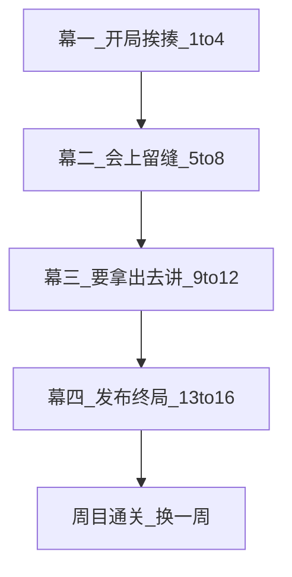
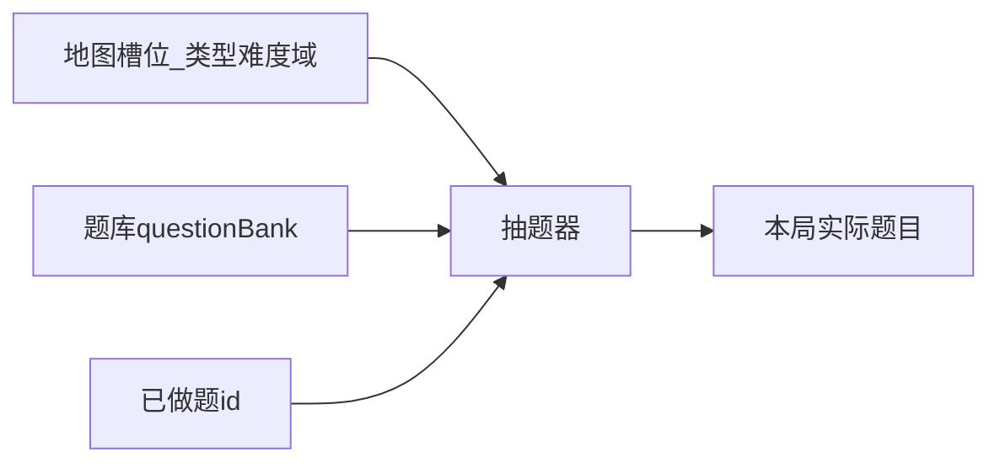

# 抬杠克星 · 产品方案（保留版）

> 从完整计划稿中筛出**需要保留、可指导后续开发**的内容。  
> 已删：重复表述、过时元信息、尚未补齐的施工细表——那些要另补，不假装已经有了。

---

## 1. 命名

| 项 | 内容 |
|----|------|
| 主名 | **抬杠克星** |
| 副标题 | **把结构炼硬，不好一问就倒** |
| 一句话 | 练的不是口才，是把话说清楚、结构站得住 |
| 品牌语气 | 名字和结算可以毒舌好玩；产品不教人抬杠，是让你不好被问倒 |
| 局内对手 | 「追问幽灵」——专找结论软、细节乱放、理由打架的地方 |

**关卡名（定稿，保留）**

1. **先甩一句** — 先说结论  
2. **细节给我下去** — 层次别乱  
3. **别给抬杠留缝** — 理由别打架  
4. **说硬了再出门** — 口语收成能拿出去讲的结构  

> 说明：第 3 关名保留「抬杠」是玩梗；对外解释统一用「会被追问 / 一问就倒」，避免用户以为产品教抬杠。

---

## 2. 产品定位（保留）

### 给谁用

开会、解释、拒绝的时候话一堆，别人一追问就乱的人。

### 解决啥问题

不是教你能说会道，是教你把话说明白、结构站得住，别一问就垮。

### 啥时候用

- **主要**：没事刷两关（通勤、睡前 5–15 分钟）  
- **加分**：开会前热热身；刚被问懵了回来对着练  

### 怎么练

在一条连续剧情里闯完「发布周」：金字塔拆成四个动作（见上关卡名），每场先挨追问再炼结构。  
**职场主线同一项目；生活关是同周平行线，用来同构迁移。**

### 别吹过头

- **能给的**：表达更难被一问就散  
- **不承诺**：当场辩赢、情商、口头流利、实时对抬  

### 定位公式

> 帮常要讲清楚、却总被追问到乱的人，  
> 用碎片时间刷完一个「发布周」剧情闯关，  
> 解决「结构一压就塌」——不是教你抬杠，是让你不好被问倒。

### 产品形态

- 本地网页小游戏，打开就玩，不用登录  
- 进度存在浏览器本地  
- **画面**：墨线工坊 · 职场寓言（见 §7；参考 HRM / 饥荒取神不取形）  
- **乐趣**：连续发布周剧情 + 单场「挨刀 → 炼硬 → 幽灵审讯」；星级决定幽灵是否问穿  
- **通关后再开一局**：叙事上「换一周 / 换项目」，题目换新（不是原题重刷）  

---

## 3. 核心玩法（剧情向 · 定稿）

### 3.0 总剧情：**发布周 · 别被问倒**

你负责一次「支付改版」上线。从周会被追问进度，一路到终局汇报。**追问幽灵**跟着你整周，专咬结构软的地方。  
地图不是题单，是**这一周的时间线**（四幕分区）。

| 幕 | 槽位 | 剧情职责 |
|----|------|----------|
| 一 · 开局挨揍 | 1–4 | 进度被问懵 → 生活也被问；学会先甩结论、细节下沉 |
| 二 · 会上留缝 | 5–8 | 方案 / 加塞 / 风险会上被拆；插入换工作商量；学会堵分类缝 |
| 三 · 要拿出去讲 | 9–12 | 周报、复盘、生活主张与拍板；口语炼成能出门的结构 |
| 四 · 发布终局 | 13–16 | 催进度、看房加码、述职、终局汇报；Boss 审讯周 |

- **职场 10 关**：同一改版的因果链（进度 → 延期 → 方案 → 加塞 → 风险 → 周报 → 复盘 → 催期 → 述职 → 终局）。  
- **生活 6 关**：同周下班后平行线——工作拧巴溢到生活。  
- **不做**：分支对话、多结局；星级只改本场审讯语气，不改下一场剧本。  
- **再闯**：框架仍是「又一个发布周」，换项目皮与题库（见 §5.1）。



### 3.1 单关三幕 + 幕间钩子


1. **冷开场（必有）**  
   场景人提问 → 播预写 `softReply`（你原先的软回答）→ 幽灵甩出 `ghostOpening`（先挨一刀）→ CTA「把话说硬」。
2. **炼结构**  
   在**表达架**上完成四种操作之一（见下表）；话术是「焊死 / 堵缝」，不是「做分类题」。Boss 关多一步「对方到底在问什么」。
3. **审讯结算**  
   按星级演出：0 星问穿裂开；1–2 星咬到缝并标陷阱；3 星幽灵哑火 + 迁移提示。算法仍用 §4.2。  
4. **幕间钩子**  
   过关后播预写 `bridgeOut`，点明时间或因果，再回时间线地图。

| 关卡 | 练什么 | 在本周剧情里干什么 | 表达架交互 |
|------|--------|--------------------|------------|
| 先甩一句 | 结论先行 | 被问「什么情况 / 来不来」时先焊死结论句 | 从噪声里选出真正的结论句 |
| 细节给我下去 | 三层结构 | 延期 / 看房时别让细节替你定调 | 拖进：结论层 / 理由层 / 细节层 |
| 别给抬杠留缝 | MECE | 会上分条别给幽灵留重叠缝 | 论据分桶；抓重叠 / 假分类 |
| 说硬了再出门 | 综合 | 周报 / 复盘 / 终局：口语收成能拿出去讲 | 选句 / 排序拼出三层表达 |

**MVP 判定**：不做 AI 自由批改；标准答案拼图 + 预写幽灵台词与「一问就倒」干扰项。

---

## 4. 题目设计标准（保留）

### 难度底线

- 前 2 关：教会交互，仍留 1 个真陷阱  
- 中段：半正确干扰（情绪当结论、细节上抬、伪分类、答非所问）  
- 后段：噪声 6–9 条；先想清「对方在问什么」再动手  
- 通关 ≠ 满分：1 星可过；3 星几乎不留追问口  

### 干扰项类型（保留）

1. 过程当结论  
2. 情绪当结论  
3. 细节上抬  
4. 伪 MECE  
5. 正确但答错题  

### 场景配比（保留）

- 职场约 **10** 槽位：延期、方案取舍、催进度、拒加塞、周报、同步风险、复盘、述职等  
- 生活约 **6** 槽位：拒约、看房/租房、换工作商量、吐槽变主张等  

每关结算：**迁移提示** + **会被追问的点**

### 难度曲线（概览 · 保留）

| 关序 | 类型侧重 | 挑战点 |
|------|----------|--------|
| 1–2 | 先甩一句 | 答问句 vs 讲故事 |
| 3–4 | 细节给我下去 | 细节不上抬 |
| 5–8 | 别给抬杠留缝 + 提炼进阶 | 假分组、半正确结论 |
| 9–12 | 说硬了再出门 | 长口语 → 三层结构 |
| 13–16 | Boss 混合 | 先看清会被问哪，再焊结构 |

### 4.1 十六槽位提纲表（定稿 · `map.ts` 直接对照）

地图只固定下表列；**具体题目从 `questionBank` 按「类型 + 难度 + 域」抽取**。主线周目可再绑 `mainlineSlot`。  
**剧情节拍 / bridgeOut** 保证关与关在同一「发布周」里可读；换题不换节拍骨架。

**类型码（与四种关卡组件一一对应）**

| 码 | 关卡名 | 交互 |
|----|--------|------|
| `conclude` | 先甩一句 | 从噪声里选出真正的结论句 |
| `layer` | 细节给我下去 | 拖进结论 / 理由 / 细节三层 |
| `mece` | 别给抬杠留缝 | 论据分桶；抓重叠 / 假分类 |
| `export` | 说硬了再出门 | 选句 / 排序拼出三层表达 |

**难度档**：`intro` 教会交互仍留真陷阱 → `mid` 半正确干扰 → `late` 噪声 6–9 条 → `boss` 先判追问口再焊结构（组件仍用上表四码之一，题面加「对方到底在问什么」前置）。

**「提炼进阶 / Boss 混合」怎么落表**

- 5–8：以 `mece` 为主；第 7 槽用进阶 `conclude`（半正确结论），兑现「提炼进阶」。
- 13–16：四码各一槽 Boss，不新开第五种交互；混合体现在噪声与追问前置，不体现在新组件。

| 槽 | 幕 | type | diff | 域 | 剧情节拍（本周位置） | 场景提纲 | bridgeOut（过关钩子示意） |
|----|----|------|------|----|----------------------|----------|---------------------------|
| 1 | 一 | conclude | intro | 职场 | 周一周会：改版被当场问懵 | 领导问「现在什么情况」 | 风控还卡着；延期那一刀已在门口。 |
| 2 | 一 | conclude | intro | 生活 | 同日晚：朋友邀局，工作拧巴溢出来 | 拒约周末夜场 | 答应不了社交；看房的事也被催了。 |
| 3 | 一 | layer | intro | 职场 | 会后私聊：周五还守不守 | 延期要不要申请 | 延期意向已立；伴侣又约了周末看房。 |
| 4 | 一 | layer | intro | 生活 | 同晚：看房行程要分层说清 | 周末去不去、条件怎么说 | 幕一过。下周会上要分条，别留缝。 |
| 5 | 二 | mece | mid | 职场 | 方案会：A/B 怎么汇报才不打架 | 方案取舍分桶 | 方案桶焊了；加塞需求已经在群里@你。 |
| 6 | 二 | mece | mid | 职场 | 加塞：接不接不能用空话桶 | 拒临时需求 | 加塞挡下；家里开始问「要不要换工作」。 |
| 7 | 二 | conclude | mid | 生活 | 平行线：换工作只能先给硬结论 | 投不投简历 | 生活先钉住；明天会上同步风险。 |
| 8 | 二 | mece | mid | 职场 | 风险同步：三桶互斥 | 风险 / 依赖 / 决策 | 幕二过。该把话收成能拿出去讲的了。 |
| 9 | 三 | export | late | 职场 | 周报：流水账炼出门 | 周报结构 | 周报能讲了；回家别只剩吐槽。 |
| 10 | 三 | export | late | 生活 | 吐槽收成主张 | 室友 / 家务类主张 | 主张立了；复盘会要用同样肌肉。 |
| 11 | 三 | export | late | 职场 | 延期复盘开口 | 根因 + 下步 | 复盘过关；家里大额支出要拍板。 |
| 12 | 三 | export | late | 生活 | 家庭拍板：决定先于感受 | 花钱 / 行程 | 幕三过。发布周终局，幽灵加重审讯。 |
| 13 | 四 | conclude | boss | 职场 | Boss：到底能不能按期 | 催进度硬结论 | 结论钉死；晚上看房话题会加码搅局。 |
| 14 | 四 | layer | boss | 生活 | Boss：预算通勤时间搅在一起 | 看房加码分层 | 生活线焊住；述职结构别重叠。 |
| 15 | 四 | mece | boss | 职场 | Boss：述职三块边界 | 成绩 / 问题 / 下一步 | 述职桶清了；终局汇报，一次讲完。 |
| 16 | 四 | export | boss | 职场 | Boss：终局汇报出门 | 口语一锅粥收结构 | 本周通关。幽灵换一批卷宗——再来一周？ |

**配比校验**

| 项 | 数量 | 槽位 |
|----|------|------|
| 职场 | 10 | 1, 3, 5, 6, 8, 9, 11, 13, 15, 16 |
| 生活 | 6 | 2, 4, 7, 10, 12, 14 |
| `conclude` | 4 | 1, 2, 7, 13 |
| `layer` | 3 | 3, 4, 14 |
| `mece` | 4 | 5, 6, 8, 15 |
| `export` | 5 | 9–12, 16 |
| `intro` / `mid` / `late` / `boss` | 各 4 | 1–4 / 5–8 / 9–12 / 13–16 |

> 开发对照：`map.ts` 每项至少含 `slot`、`type`、`difficulty`、`domain`、`act`（幕）、`beat`（剧情节拍短文）；`bridgeOut` 可放 map 或题库（主线用上表，备选题写同幕等价钩子）。

### 4.2 星级计分公式（定稿 · `scoring.ts`）

原则对齐原文：**1 星可过；3 星几乎不留追问口；通关 ≠ 满分**。不做 AI 批改，只比对标准答案与陷阱标记。

#### 每题需带的评判字段

| 字段 | 用途 |
|------|------|
| `units[]` | 可评判单元（选项卡 / 拖放卡 / 分桶项），各有稳定 `id` |
| `gold` | 标准答案（按类型结构不同，见下） |
| `fatalTrapIds[]` | 选中或放错即算「给追问留缝」的单元 id |
| `bossPrompt?` | 仅 `boss`：前置「对方到底在问什么」的选项与 `goldId` |

#### 提交后三个中间量

```
corePass  : 核心结构是否过关（按类型，见下）——不过则 0 星
trapHits  : 玩家答案命中的 fatalTrapIds 去重个数
accuracy  : 判对的 units 数 ÷ 参与评判的 units 总数   ∈ [0, 1]
```

#### 星级映射（四类型共用）

| 星 | 条件 | 能否过关 |
|----|------|----------|
| **0** | `!corePass` | 否，本关可重试 |
| **1** | `corePass` 且（`trapHits ≥ 1` **或** `accuracy < 0.85`） | 是 |
| **2** | `corePass` 且 `trapHits === 0` 且 `0.85 ≤ accuracy < 1` | 是 |
| **3** | `corePass` 且 `trapHits === 0` 且 `accuracy === 1` | 是 |

**Boss 封顶**：`difficulty === 'boss'` 时，若前置 `bossPrompt` 选错，则最终星级为 `min(按上表算出的星, 2)`。选对不加成，只取消封顶。

#### 各类型：`corePass` / `accuracy` / `trapHits` 怎么算

**`conclude`（先甩一句）**

- 玩家选出一个结论卡（MVP 单选）。
- `corePass`：所选 id ∈ `gold.conclusionIds`（主线通常仅 1 个金标）。
- `accuracy`：选对为 `1`，否则 `0`（此时必 `!corePass` → 0 星）。
- `trapHits`：若选错且所选 id ∈ `fatalTrapIds`，计 1（展示用）；过关判定仍只看 `corePass`。
- 结果：选对即通常 **3 星**（单选无部分分）。若将来金标允许多个「可过但偏软」结论：软结论放 `gold.softConclusionIds` → `corePass` 仍真，但强制按 **1 星** 结算（兑现「可过不满星」）。

**`layer`（细节给我下去）**

- 每张卡放入 `conclusion` | `reason` | `detail` 一层。
- `corePass`：结论层集合 **恰好等于** `gold.conclusionIds`（结论对才能过；理由/细节可错）。
- `accuracy`：层放对的卡数 ÷ 卡总数。
- `trapHits`：放进结论层、且 id ∈ `fatalTrapIds` 的卡数（典型：细节上抬、情绪当结论）。

**`mece`（别给抬杠留缝）**

- 每项分进题目给定的桶；允许题目声明「应标为重叠/假分类」的干扰桶。
- `corePass`：所有 `gold.mustIds` 的分桶与 `gold.bucketOf[id]` 一致（必放对的骨干论据）。
- `accuracy`：全部分桶判对的项数 ÷ 项总数。
- `trapHits`：分桶错误且 id ∈ `fatalTrapIds` 的项数（伪 MECE、重叠塞进同一真桶等）。

**`export`（说硬了再出门）**

- 从素材中选出并排成「结论 → 理由 → 细节」可出门结构（选句 + 排序）。
- `corePass`：结论位 id ∈ `gold.conclusionIds`，且至少 `gold.minReasonCount`（默认 2）条理由位 id 落在 `gold.reasonIds` 内、互不冲突（题目可标 `conflictPairs`：两理由同现则理由部分不得满分）。
- `accuracy`：结论对占 1 个 unit + 每条理由/细节位对各 1；分母为结论 1 + 理由槽数 + 细节槽数。
- `trapHits`：选进结构的 id ∈ `fatalTrapIds` 的个数（过程当结论、正确但答错题等）。

#### 结算页输出（与星级同时算）

- 列出本次 `trapHits` 对应的陷阱类型标签（题面预标：过程当结论 / 情绪当结论 / 细节上抬 / 伪 MECE / 正确但答错题）。
- 0 星：强调「核心结论/结构还没站住」。
- 1–2 星：指出仍会被追问的点（用题内 `followUpLines`）。
- 3 星：短句肯定 + 迁移提示。

#### 伪代码（实现对照）

```ts
function stars(corePass, trapHits, accuracy, bossPromptWrong): 0|1|2|3 {
  if (!corePass) return 0;
  let s: 1|2|3 =
    trapHits >= 1 || accuracy < 0.85 ? 1 :
    accuracy < 1 ? 2 : 3;
  if (bossPromptWrong) s = Math.min(s, 2) as 1|2;
  return s;
}
```

---

### 4.3 解锁与进度规则（定稿 · `progress.ts`）

#### 本局（一个周目）

| 规则 | 内容 |
|------|------|
| 初始 | 仅 **槽位 1** 解锁；2–16 灰显不可进 |
| 过关 | 某槽提交后星级 **≥ 1** → 该槽记为已通关；**下一槽位解锁**（线性 `N → N+1`） |
| 0 星 | 不解锁下一关；可立即重试本关；地图上该槽保持「已解锁未过」 |
| 重打已过关 | 允许；本局该槽星级取 **`max(旧星, 新星)`**（只升不降） |
| 未解锁 | 点击给一句短提示：「先过上一关（1 星即可）」 |
| 本周目通关 | 槽位 **16** 星级 ≥ 1 → `runCleared = true`；首页出现「再闯一局」 |

不做：星级门槛解锁 Boss、平均星要求、隐藏关。Boss 只是难度档，仍走线性解锁。

#### 再闯一局

- 清空本局：各槽 `questionId`、星级、解锁进度；回到「仅槽 1 解锁」。
- **保留**全局：已做 `questionId`（及时间戳）、历史通关次数 / 当前周目号。
- 按 §5.1 为 16 槽重抽题；再按上表线性推进。

#### 每日一练

- **不走地图解锁**：可直接从题库抽一题（优先未满星类型 / 近期未做）。
- 结算星级写入全局做过记录；**不**自动改写本局地图槽位星级（避免和主线进度拧巴）。
- 若抽到的题恰好是本局某槽当前题，可选：回写该槽 `max` 星——MVP **不做回写**，逻辑更简单。

#### 重置

- 「清除进度」：本局 + 全局做过题 + 周目号一并清空（需二次确认）。
- 不做云同步。

#### 存档字段最小集

```ts
{
  run: number;                    // 周目，从 1 起
  runCleared: boolean;
  unlockedThrough: number;        // 已解锁到的最大槽位 1–16
  slots: Record<number, { questionId: string; stars: 0|1|2|3 }>;
  seen: Record<string, number>;   // questionId → 上次完成时间戳
}
```

> `unlockedThrough = k` 表示 1…k 可进；过关槽位 `n` 且 `stars≥1` 时令 `unlockedThrough = max(unlockedThrough, n+1)`（封顶 16）。

---
## 5. 游戏循环与信息架构（保留）

**循环**

- 16 关地图；职场/生活小标签；未解锁灰显  
- 1–3 星；复盘标注陷阱类型  
- `localStorage` 存档；可重置  
- 每日一练：加权抽尚未满星 / 近期未做类型  
- **通关后再闯：题目更新**（见 5.1）  

**页面**

1. 首页：主名 + 副标题 +「开始练」/「每日一练」；通关后出现「再闯一局」  
2. 关卡地图  
3. 关卡页：场景卡 + 交互区  
4. 结算页：星级、会被追问的点、迁移提示  
5. 原理小屋：金字塔三层图 +「为啥这样更不容易被问倒」  

---

## 5.1 通关后再闯 · 换题规则（新增）

**你要的**：打通一遍之后再开一局，题目要换，别整图原题重刷。

**怎么做（本地、不用后端、不用 AI 当场出题）**

1. **地图槽位固定，题目从题库抽**  
   - 16 个节点只固定：关卡类型、难度、职场/生活（保证曲线）  
   - 真正玩的内容在题库 `questionBank`，每题有稳定 `id`  

2. **第一周目：走主线题**  
   - 每个槽位先绑一道主线题，新手路径可控  

3. **通关后点「再闯一局」：按槽位重抽**  
   - 同槽位优先抽：同类型 + 同难度 + 同域，且尽量没做过的题  
   - 池子抽干了：抽「最久没做」的题；同一局里 16 个 `questionId` 互不重复  
   - 新周目清空本局星级与进度；保留全局「做过的题 id」用来避重  

4. **题库要够大，否则换不出新**  
   - 底线：每种类型至少 4 题 → 合计约 **≥ 32 题**（主线 16 + 备选 ≥ 16）  
   - 以后只加题库、不改地图，就能继续再闯换新  

5. **每日一练**  
   - 和再闯共用避重逻辑：优先近期未做 / 弱项类型  



**存档多记**

- 是否已通关、当前周目  
- 本局：`槽位 → questionId`、星级  
- 全局：做过的 `questionId`（可带时间，方便「最久未做」）  

---

## 6. 内容示例与题库（定稿）

### 6.0 每题字段（开发用）

- `id`、`type`、`difficulty`、`domain`
- `mainlineSlot?: 1–16`（仅主线）
- 场景问句、`units[]`（文案 + 可选 `trapTag`）
- `gold` / `fatalTrapIds` / `followUpLines` / 迁移提示
- `bossPrompt?`（仅 boss）

---

### 6.1 完整例 · 先甩一句 · 生活（模板保留）

| 项 | 内容 |
|----|------|
| id | `M02`（主线槽 2） |
| type / diff / domain | `conclude` / `intro` / 生活 |
| **场景** | 朋友问：「这周六夜场，来不来？你最近别又说忙。」 |
| **会被追问** | 只说忙/累 →「那谁不忙」；「再说吧」→「你是不是不想来」 |
| **合格结论** | 这周六去不了；下周六我请，地点你定。 |
| **选项卡（示意）** | ①金标结论同上 ②情绪：我最近真的太累了（情绪当结论） ③假结论：先研究研究再定（过程当结论） ④细节上抬：上次那家店停车好远 ⑤偏题：你们玩什么游戏 |
| **fatalTrap** | ②③④ |
| **迁移提示** | 拒约结论 = 决定 + 替代；感受放理由层，别当第一句 |

---

### 6.2 完整例 · 先甩一句 · 职场（新增）

| 项 | 内容 |
|----|------|
| id | `M01`（主线槽 1） |
| type / diff / domain | `conclude` / `intro` / 职场 |
| **场景** | 周会，领导看着进度表问：「支付改版这事，现在什么情况？」 |
| **对方在问** | 要的是**现状结论**（能不能按原计划 / 卡在哪），不是故事从头讲 |
| **会被追问** | 只铺过程 →「所以到底怎样？」；只诉苦 →「要我帮你什么？」；「还在推进」→「推进到哪了？」 |
| **合格结论** | 支付改版**整体黄灯**：联调已完成 80%，卡在风控回调；**本周四**能给是否仍按原定周五上线的明确结论。 |
| **选项卡** | ①金标：同上 ②过程当结论：我们这周每天都在跟风控对接口 ③情绪当结论：风控那边响应太慢，挺被动的 ④假结论：还在推进，大家都很努力 ⑤细节上抬：昨天日志里有一条超时重试 ⑥正确但答错题：下季度还想做一次体验改版（真规划，但不是在答「现在什么情况」） |
| **fatalTrap** | ②③④⑤⑥ |
| **迁移提示** | 被问「什么情况」→ 先给灯色/是否按期 + 卡点 + 下一次可验收时间；过程细节待命中再展开 |

---

### 6.3 完整例 · 细节给我下去 · 职场延期（新增）

| 项 | 内容 |
|----|------|
| id | `M03`（主线槽 3） |
| type / diff / domain | `layer` / `intro` / 职场 |
| **场景** | 产品经理私聊：「联调还差两天，周五上线还守得住吗？要不要申请延期？」 |
| **会被追问** | 一上来念日志/心情 → 对方替你定调；细节塞进结论层 →「所以你到底建议啥」 |
| **三层金标** | **结论**：建议申请延期至下周三上线，今天同步风险与影响面。 **理由**：①风控回调不稳定，按期上线回滚成本高 ②业务侧可接受晚 3 天，不可接受周五故障 ③联调剩余项有明确负责人与截止。 **细节**：超时重试次数、昨日失败案例、延期公告文案草稿——只进细节层 |
| **干扰（应远离结论层）** | 「我昨晚盯到 12 点」（情绪/过程）「有一条日志很奇怪」（细节上抬）「我们一直很努力」（假结论） |
| **corePass** | 结论层恰好为金标结论句（或题内等价句）；细节/情绪卡进结论层 → `trapHits` |
| **迁移提示** | 延期沟通：结论先说「延不延 + 延到何时」；证据下沉，别让日志替你做决定 |

---

### 6.4 题库清单 ≥32（定稿 · `questionBank` 目录）

总量 **32**：主线 `M01–M16` + 备选 `A01–A16`。抽题只认 `type + difficulty + domain`；主线另绑 `mainlineSlot`。

**池深校验（支撑再闯不撞车）**

| type | diff | domain | 题数 | 覆盖槽 |
|------|------|--------|------|--------|
| conclude | intro | 职场 | 2 | 1 |
| conclude | intro | 生活 | 2 | 2 |
| layer | intro | 职场 | 2 | 3 |
| layer | intro | 生活 | 2 | 4 |
| mece | mid | 职场 | 6 | 5,6,8 |
| conclude | mid | 生活 | 2 | 7 |
| export | late | 职场 | 4 | 9,11 |
| export | late | 生活 | 4 | 10,12 |
| conclude | boss | 职场 | 2 | 13 |
| layer | boss | 生活 | 2 | 14 |
| mece | boss | 职场 | 2 | 15 |
| export | boss | 职场 | 2 | 16 |
| **合计** | | | **32** | |

#### 主线 16

| id | 槽 | type | diff | 域 | 场景提纲 | 主陷阱 | 合格结论 / 过关核（一句话） |
|----|----|------|------|----|----------|--------|---------------------------|
| M01 | 1 | conclude | intro | 职场 | 支付改版「现在什么情况」 | 过程/情绪当结论、答错题 | 黄灯 + 卡点 + 周四给上线结论 |
| M02 | 2 | conclude | intro | 生活 | 朋友邀周六夜场 | 情绪、假结论「再说」 | 周六不去；下周六我请你定地点 |
| M03 | 3 | layer | intro | 职场 | 联调未完，周五上线？ | 细节上抬、过程进结论 | 建议延至下周三；今日同步影响面 |
| M04 | 4 | layer | intro | 生活 | 伴侣邀周末看房 | 感受当结论、条件乱层 | 这周不去看房；下周六 + 先定预算上限 |
| M05 | 5 | mece | mid | 职场 | A/B 方案汇报怎么分条 | 假分组、桶重叠 | 按「成本 / 风险 / 上线周期」分桶且不交叠 |
| M06 | 6 | mece | mid | 职场 | 临时加塞需求接不接 | 伪 MECE「重要又紧急」空桶 | 按「是否影响本周承诺 / 可否下周排期」二分 |
| M07 | 7 | conclude | mid | 生活 | 家人问要不要投简历换工作 | 半正确结论、答非所问 | 先投 3 家试水；谈妥前不提离职 |
| M08 | 8 | mece | mid | 职场 | 会上同步风险与依赖 | 分类打架 | 「我方风险 / 对方依赖 / 需决策项」三桶互斥 |
| M09 | 9 | export | late | 职场 | 周报流水账 | 过程当结论 | 结论：本周目标完成度；理由 3；细节附录 |
| M10 | 10 | export | late | 生活 | 吐槽室友收成主张 | 情绪当结论 | 结论：下周一起定值日表；理由；细节规则 |
| M11 | 11 | export | late | 职场 | 延期事故复盘开口 | 过程当结论、噪声多 | 结论：根因类别 + 下步；别先念时间线 |
| M12 | 12 | export | late | 生活 | 家庭大额支出要拍板 | 问的是决定却答感受 | 结论：这个月不买；理由预算；细节比价记录 |
| M13 | 13 | conclude | boss | 职场 | 「到底能不能按期」 | 先判问句再选硬句 | 不能按期；最早下周三；今日发变更说明 |
| M14 | 14 | layer | boss | 生活 | 看房：预算/通勤/时间搅在一起 | 先判会从哪层被揪 | 结论层只放是否看 / 预算上限；通勤进理由 |
| M15 | 15 | mece | boss | 职场 | 述职：成绩/问题/下一步 | 三块重叠 | 三桶边界写死；同一事实只进一桶 |
| M16 | 16 | export | boss | 职场 | 终局汇报口语一锅粥 | 四关合力 | 出门结构完整且无 fatalTrap 才满星 |

#### 备选 16（再闯 / 每日一练）

| id | type | diff | 域 | 场景提纲 | 主陷阱 | 合格结论 / 过关核（一句话） |
|----|------|------|----|----------|--------|---------------------------|
| A01 | mece | mid | 职场 | 资源争夺：两项目抢同一后端 | 假分组 | 「人天占用 / 截止日期 / 可降级范围」互斥分桶 |
| A02 | mece | mid | 职场 | 客户投诉归类同步 | 重叠桶 | 「产品缺陷 / 使用问题 / 预期差」三分且不交叠 |
| A03 | mece | mid | 职场 | 排期会：需求池怎么陈述 | 伪分类 | 「本迭代必做 / 可延后 / 需澄清」三桶 |
| A04 | export | late | 职场 | 向上同步：阻塞两天的接口 | 细节上抬 | 先给阻塞结论与要的决策；日志进细节 |
| A05 | export | late | 职场 | 跨组对齐会开场 | 过程当结论 | 结论：今天要达成的唯一决定；理由；细节议程 |
| A06 | export | late | 生活 | 拒第二次酒局 | 情绪当结论 | 结论：今晚不去；改周日午饭；感受下沉 |
| A07 | export | late | 生活 | 和伴侣谈家务分工 | 感受答决定 | 结论：本周试行表；理由公平；细节条目 |
| A08 | conclude | intro | 职场 | 老板问：「方案批了没」 | 假结论「还在走」 | 已批 / 未批 + 卡在谁 + 下次可问时间 |
| A09 | conclude | intro | 生活 | 同学拉你入无薪项目 | 「先看看」假结论 | 不参加；可介绍人选；不留开口 |
| A10 | layer | intro | 职场 | 要不要砍掉次要功能保期 | 细节上抬 | 结论：砍功能保期；理由；细节砍哪些 |
| A11 | layer | intro | 生活 | 租房续约谈不谈涨价 | 情绪进结论 | 结论：续约但涨幅上限 X%；条件进理由 |
| A12 | conclude | mid | 生活 | 要不要搬去合租降压 | 半正确「都行」 | 搬；下月 15 前签；预算上限写清 |
| A13 | conclude | boss | 职场 | 发布窗口：「今晚切不切流量」 | 答错题讲情怀 | 不切；改明早；回滚预案已备（先答切不切） |
| A14 | layer | boss | 生活 | 家长催结婚/购房话题搅在一起 | 多层追问口 | 结论层只答当下决定；金钱与时间进理由/细节 |
| A15 | mece | boss | 职场 | 半年总结结构 | 成绩与下一步粘连 | 「结果 / 反思 / 下半年承诺」三分无重叠 |
| A16 | export | boss | 职场 | 向业务讲清技术债要不要还 | 正确但答错题 | 结论：本季还/不还 + 代价；别先开技术课 |

> 实现时：`M01–M16` 必须写满可玩 units；`A01–A16` 可先按上表文案扩成同结构卡组。完整可玩卡组已示范：`M01`、`M02`、`M03`（§6.1–6.3）。

---

## 7. 技术骨架（保留）

- Vite + React + TypeScript；纯 CSS  
- 视觉：深底 + 琥珀/锈橙强调；避开紫渐变/奶油衬线  
- 拖拽：`@dnd-kit/core`  
- 项目目录名：`gang-buster`  
- 数据：`map.ts`（16 槽位）+ `questionBank.ts`（题库）  
- 逻辑：`scoring.ts` / `progress.ts` / `traps.ts` / `pickQuestion.ts`  

```
gang-buster/
  src/
    App.tsx
    pages/ Home / Map / Level / Result / Primer
    components/ PyramidSlots / CardBank / StarRating / SceneCard
    data/map.ts  questionBank.ts
    lib/scoring.ts  progress.ts  traps.ts  pickQuestion.ts
    styles/
```

---

## 8. 明确不做（MVP · 保留）

- 登录、排行榜、后端  
- 语音（模型可预留 `mode: 'writing'`）  
- **运行时 LLM 自动出题**（换题靠预置题库扩容）  
- LLM 批改  
- 弱智干扰项、纯说教关  

---

## 9. 成功标准（保留 · 略收紧）

- 30 秒内能进第 1 关并提交  
- 打开首页就懂：练把话说清楚，不是教抬杠  
- 职场关明显多于生活关  
- 断网可通关；每关有「会被追问的点」+ 迁移提示  
- **通关后再闯：至少一半槽位换到与上周目不同的题目**（题库够的前提下）  
- 效果愿望（验收方式另定）：玩过若干关后，能写出「结论句 + 3 条不打架的理由」  

---

## 10. 实现顺序（保留作开发 checklist）

1. 脚手架 + 首页/地图 + localStorage  
2. 四种关卡组件 + 陷阱标签结算  
3. 题库结构 + 主线 16 题；备选补到总量 ≥ 32  
4. 抽题器 +「再闯一局」换题 + 已做题避重  
5. 结算点评 + 动效 + 每日一练  
6. 通关自测与难度微调  

---

## 附录：待另补

| 状态 | 内容 |
|------|------|
| **已完成** | 16 槽位提纲表 → **§4.1** |
| **已完成** | 星级计分公式 → **§4.2** |
| **已完成** | 解锁规则 → **§4.3** |
| **已完成** | 职场完整例（conclude + layer）→ **§6.2–6.3** |
| **已完成** | 题库 ≥32 题目清单 → **§6.4**（M01–M16 + A01–A16） |
| 内容扩写（开发时） | 将 A01–A16 与未示范主线题扩成与 M01 同粒度的 units 卡组 |
| 说明 | 产品侧附录项已齐；可进入 `gang-buster` 脚手架与题库落地 |
